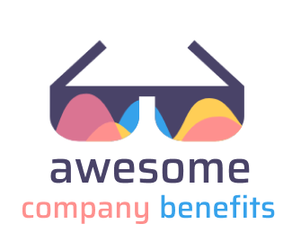

	
	 
	 
	

	<a href="contributing.md">Contribution guide</a>&nbsp;&nbsp;&nbsp;
	<a href="create-list.md">Creating a list</a>&nbsp;&nbsp;&nbsp;

 

# Awesome Company Benefits

The curated list of awesome employeee benefits and perks offered by companies. This repository is maintained by open source community.

# Why are employee benefits so important?

Offering benefits to employees is important because it helps them to feel more fulfilled and more satisfied. A solid employee benefits package can help to attract and retain talent. Benefits can help you differentiate your business from competitors.

## A - C

- [AAA](companies/aaa.md) | Sydney, Australia / Remote | Fintech

